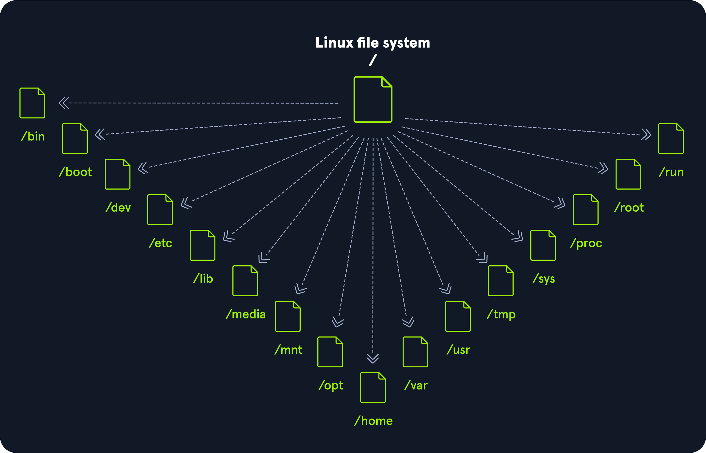

# HTB-Linux-Fundamentals

## Part 1: Introduction

### 1. Linux Structure

#### What is Linux?
- An open-source operating system (OS) used in computers, servers, and mobile devices.
- Manages hardware resources and enables communication between software and hardware.
- Available in different distributions (distros), e.g., Ubuntu, Debian, RedHat, Fedora, Parrot OS.

#### Why It Matters in Cybersecurity
- Robust, flexible, secure, and open-source.
- Offers fine control over system behavior and configuration.
- Frequently used in cybersecurity labs, servers, and investigative environments.

---

### 2. History

- **1970**: Unix OS released by Ken Thompson and Dennis Ritchie (AT&T).
- **1977**: BSD released but halted by legal issues due to AT&T's Unix code.
- **1983**: GNU Project started by Richard Stallman to create a free Unix-like OS.
- **1991**: Linus Torvalds (student) created the first Linux kernel.
- Licensed under the **GNU General Public License (GPL)** — allows modification and redistribution.
- Now has over **23 million lines of source code** and powers systems from servers to Android devices.

---

### 3. Philosophy

| Principle                             | Description                                                                 |
|---------------------------------------|-----------------------------------------------------------------------------|
| Everything is a file                  | Configurations and resources are text files.                               |
| Small, single-purpose programs        | Tools do one job well and can be combined.                                 |
| Chain programs for complex tasks      | Commands can be piped together.                                            |
| Avoid captive user interfaces         | CLI/shell preferred for user control.                                      |
| Text-based configuration              | E.g., `/etc/passwd` stores registered users.                               |

---

### 4. Linux Components

| Component       | Description                                                                 |
|------------------|-----------------------------------------------------------------------------|
| **Bootloader**     | Starts the boot process (e.g., GRUB).                                       |
| **Kernel**         | Core part that manages hardware resources.                                  |
| **Daemons**        | Background services (e.g., printing, networking).                           |
| **Shell**          | Command-line interface (e.g., Bash, Zsh).                                  |
| **Graphics Server**| Handles graphical output (e.g., X server).                                 |
| **Window Manager** | GUI environment (e.g., GNOME, KDE).                                        |
| **Utilities**      | Tools and applications for system tasks.                                   |

---

### 5. Linux Architecture

| Layer        | Description                                                                 |
|--------------|-----------------------------------------------------------------------------|
| **Hardware**     | Physical components (CPU, RAM, etc).                                         |
| **Kernel**       | Controls access to hardware and allocates resources.                        |
| **Shell**        | User interface to communicate with kernel via commands.                    |
| **System Utility**| Tools/utilities to manage system functionality.                            |

---

### 6. Linux File System Hierarchy

- Follows a **tree-like structure** defined by the **Filesystem Hierarchy Standard (FHS)**.
- Root directory `/` is the starting point for all files and directories.

| Path     | Description |
|----------|-------------|
| `/`      | Root of the filesystem. Contains all critical files and mount points. |
| `/bin`   | Essential command binaries. |
| `/boot`  | Bootloader and kernel files. |
| `/dev`   | Device files (hardware interfaces). |
| `/etc`   | System-wide configuration files. |
| `/home`  | User home directories. |
| `/lib`   | Essential shared libraries. |
| `/media` | Mount point for removable media (USBs, etc). |
| `/mnt`   | Temporary mount point for filesystems. |
| `/opt`   | Optional software packages. |
| `/root`  | Home directory for root user. |
| `/sbin`  | System administration binaries. |
| `/tmp`   | Temporary files (cleared on boot). |
| `/usr`   | User utilities and applications. |
| `/var`   | Variable files like logs, emails, and web data. |

